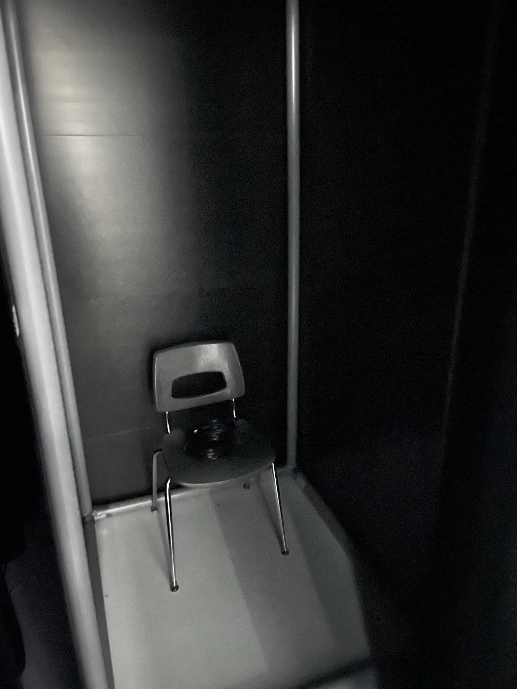
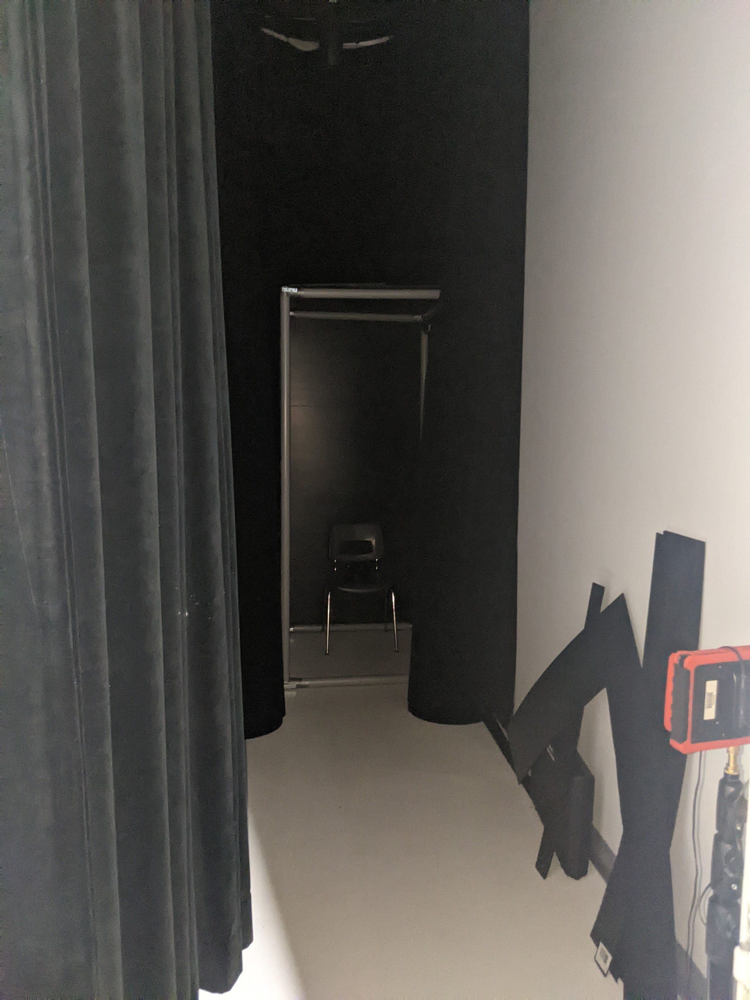
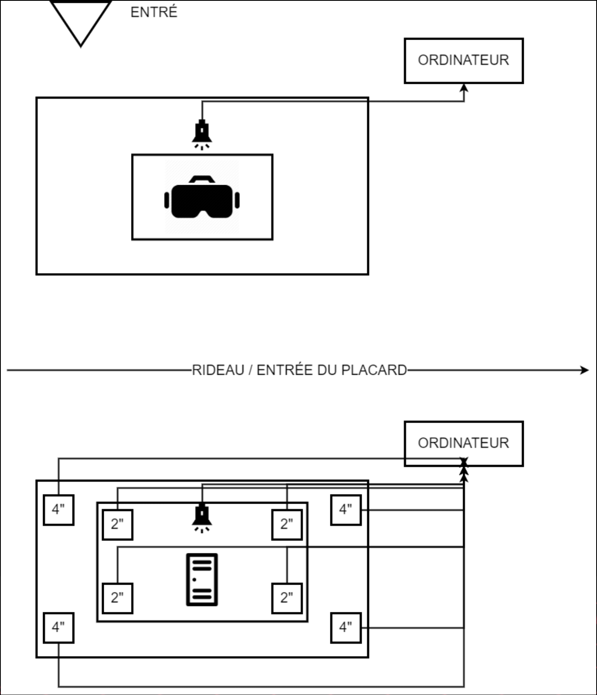

# 3 minutes #

## créateurs / créatrices ##
## Naoufal Bensaiad, Jérémie Lévesque, Samuel Poulin ##
(Nom pris de : [la page d'acceuil du projet 3 minutes](https://tim-montmorency.com/2022/projets/3-minutes/docs/web/index.html))

## la façon dont le thème du temps est exploité dans la création ##
### À travers le temps, sensibiliser la personne à l'intimidation en lui faissant passer du bon temps, suivi par du mauvais temps. Immersion dans la peau d’une personne ne vivant aucune intimidation, jouant dans un gymnase au ballon chasseur vs dans la peau d’un enfant intimidé et enfermé dans un casier. Ce projet, fait vivre a l'utilisateur un sentiments d'impuissance et détresse. Ce qui as pour but de faire comprendre l'importance de ne pas laisser une personne seul dans ce genre de situation. Ainsi, l'utilisateur resent de l'empathie a l'égard des personnes intimidés.(Texte pris de : [site de l'oeuvre 3 minutes](https://tim-montmorency.com/2022/projets/3-minutes/docs/web/preproduction.html#Planification-technique-(devis-technique)) ###

## Ambiances ##
### Respirations fortes, pleurs, cris, rires moqueurs. (Texte pris de : [site de l'oeuvre 3 minutes](https://tim-montmorency.com/2022/projets/3-minutes/docs/web/preproduction.html#Planification-technique-(devis-technique)) ###

(Photo pris : [site de l'oeuvre 3 minutes](https://tim-montmorency.com/2022/projets/3-minutes/docs/web/preproduction.html#Planification-de-la-production-(budget-et-%C3%A9tapes-de-r%C3%A9alisation))

## Ce qui sera attendu de moi durant l'expérimentation ##
###  ta respiration devient de plus en plus insupportable, l'angoisse commence à prendre le dessus 3 minutes devient un long moment interminable. ###

## 3 cours du programme qui vous semblent incontournables pour avoir les compétences pour créer ce projet ##
### Montage sonore, Réalité virtuelle, Modélisation 3D ###

( Source : [3 minutes](https://tim-montmorency.com/2022/projets/3-minutes/docs/web/index.html))
