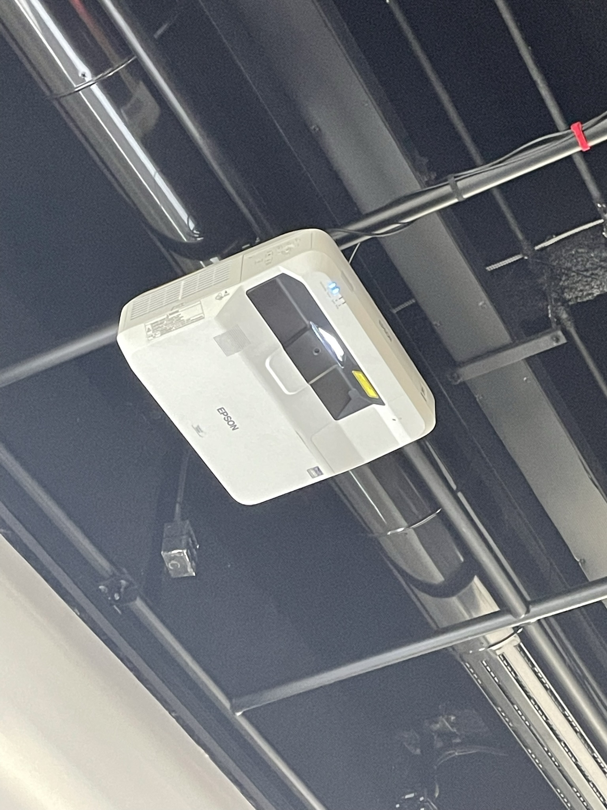
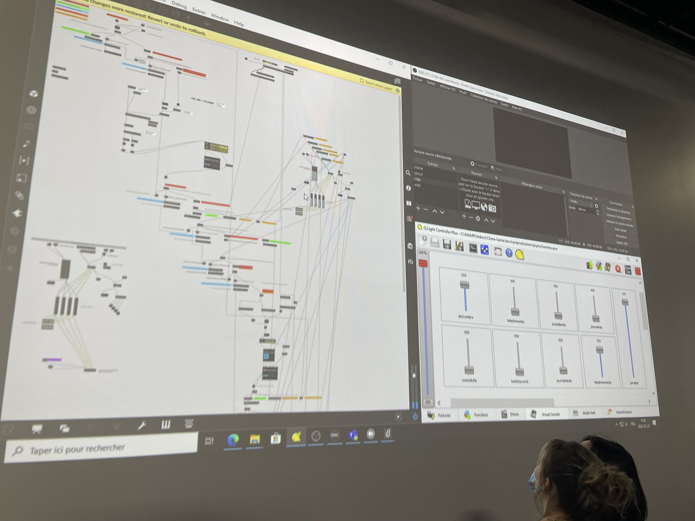
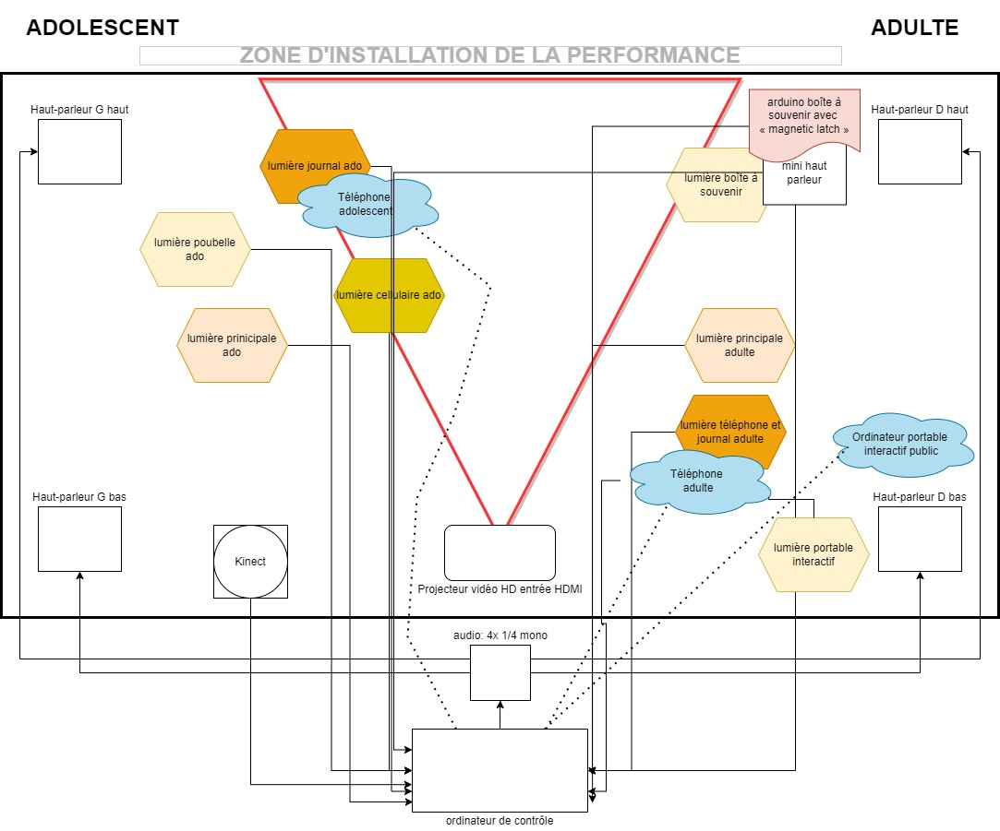

# Chère Sasha
Réalisé par: Trish Nguyen, Angelina De Silva Jeca, Karine Cormier et Sabrina kayani  
  
Par ce projet, nous souhaitons exposer comment la vie d'une personne LGBTQ+ entourée de parents qui ne supporte pas leur enfant peut changer au fil du temps. Aussi, on veux exposer comment un conflit intergénérationnel influence la vie d'une personne. (Source : [Intention de départ](https://tim-montmorency.com/2022/projets/Chere-Sasha/docs/web/preproduction.html))  
  
L'ambience du projet  est asser sombre et triste étant donné la situation du personnage on poura l'entendre pleurer, prendre des grande respiration alors qu'il y a une averse de pluie avec du tonnere en plus.
  
L'instalation néccessite un projecteur pour finaliser le look de la chambre. il y a également 4 speakers disposé sur chaque coins de la zone de projet. Tout plein d'accessoir sont laissé a la disposition de l'interacteur positionné de manière a ce que la zone de projet ai l'air d'une chambre divisé en deux avec un coté pour Sasha ado et un autre pour sasha adulte.
  
  
Le tout est gêrer via un ordinateur de contrôle avec les logiciels nécessaire pour que tous se déroule comme prévue.
  
  
### Le shéma de plantation :
  
  
Le rôle de l'interacteur est  de ce promener dans le décor et d'interragir avec les élément du décor pour en savoir plus sur la situation de nos deux personnages. Éventuellement l'intéracteur est amené à comprendre qu'en fait les deux personnages ne font qu'un avec seulement quelques années de différence.
  
### 3 cours indispensable au projet :  
"Animation 2D" pour les illustration de la chambre.  
"Conception sonore interactive" pour les son d'ambiance.  
"Programmation interactive et bases de données" pour la programmation.  
      
  (source : [Site de l'oeuvre](https://tim-montmorency.com/2022/projets/Chere-Sasha/docs/web/index.html))

