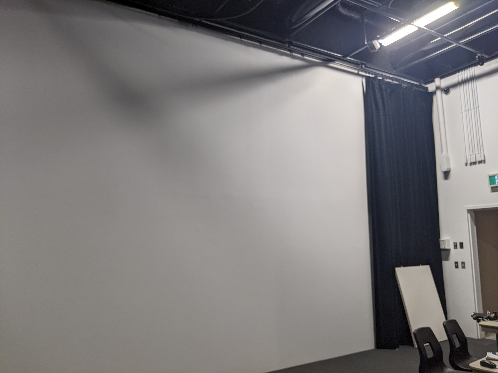

Musée de la vie (Chronaufrage)

Réalisé par : Maloney Khim, Sounthida Kong, Olivier Lalonde, Rebecca Pilotte, Émilie Fontaine

Par ce projet, nous souhaitons exposer la pression vécue dans notre société de devoir être toujours plus productives afin d'exprimer la nécessité de prendre des pauses ou du temps pour soi. Nous souhaitons ainsi faire valoir l’importance du temps « mort » et « improductif » pour s’accomplir comme humain. On utilise l'eau comme la symbolisation du temps.

L'ambiance est plutot relaxante, calme et sombre avec des couleurs froides.

L'instalation de l'oeuvre dans la salle est composé d'un projecteur qui sert à presenter les 4 grands tableaux et d'autres petits tableaux

[Site web utilisé pour avoir l'information](https://tim-montmorency.com/2022/projets/Chronaufrage/docs/web/index.html)
