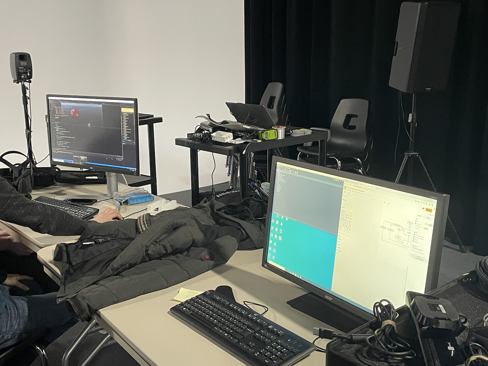

Distorsion Collective

Réalisé par : William Dubois, Ghislain Lacombe

Faire comprendre l’évolution de l’angoisse ressentie par un étudiant type et de ses difficultés sociales et scolaires rencontrées au fil des différentes phases du confinement. Les complications commencent à partir du moment où le professeur se présente, que les travaux s’accumulent, que la personne vit un sentiment d’isolement, et le tout dans une boucle sans fin qui s’accélère périodiquement et qui l’affecte mentalement. (Texte pris de : [Intention de départ](https://tim-montmorency.com/2022/projets/Distorsion-collective/docs/web/preproduction.html))

L'ambiance avant de mettre le casque VR est de la music epic qui donne l'envit de débuter une aventure et après avoir retirer le casque la music est plutot dramatique et émotionnel.

Pour l'instalation en cours, il n'a pas beaucoup de preparation physique apart l'endrois ou la personne va interagir avec le casque de VR. Mais la preparation avec les logiciels a l'aire très complexe. 

