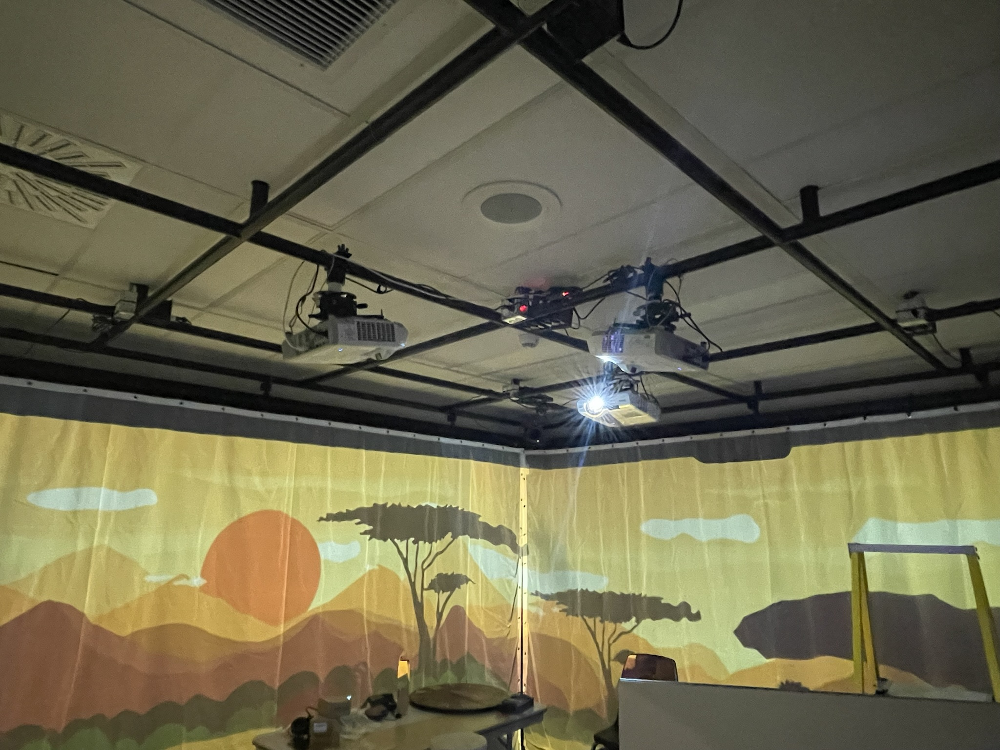
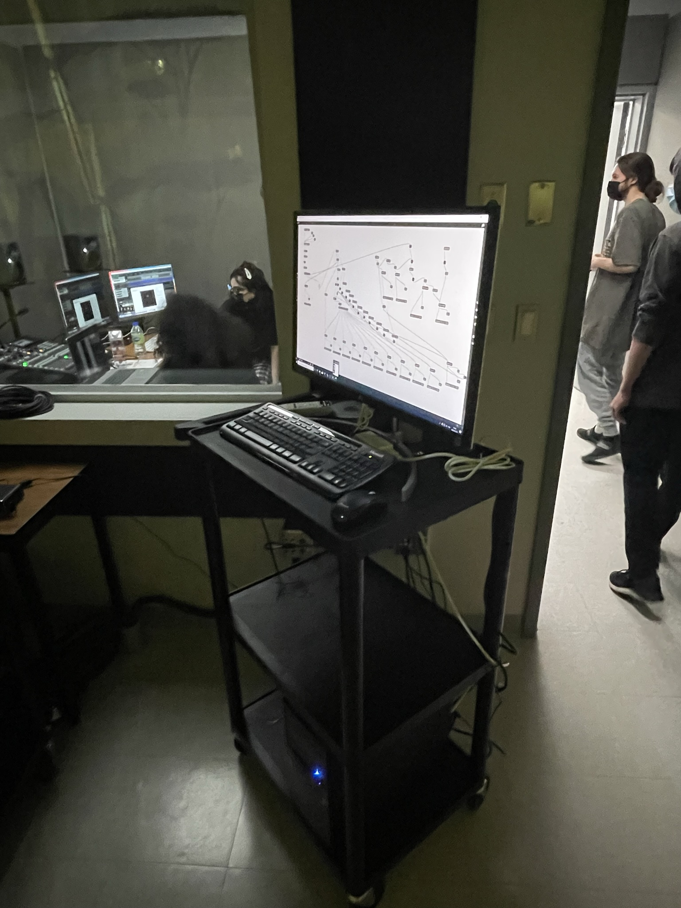

# L'horloge de l'apocalyspe
Réalisé par: Maxime Sabourin, Louis-philippe Gravel, Alexis Lacasse, Tristan Girard-Montpetit et Maxime De Falco  
  
Ce projet représente l'impact collectif sur les événements socio-politiques et environnementaux qui se produisent tout au long du temps de l'humanité. Nous abordons ce sujet à travers le concept de l'horloge de l'apocalypse. Selon ce concept, il est présentement 23h58 et la fin du monde est à 24h00. (Source : [Intention de départ](https://tim-montmorency.com/2022/projets/L-horloge-de-l-apocalypse/docs/web/preproduction.html))  
  
L'ambience du projet change à chaque fois qu'on bouge les aiguilles de l'horloge. Ex: À 5h on devrais être plongé dans une ambiance médieval alors qu'a 8h on est plutôt dans une ambiance style vegas avec beaucoup de lumières coloré.  
  
l'instalation néccessite 4 speakers dans chaque coins de la pièces. Il y a aussi 3 projecteur pointer sur 3 mur côte a côte destiné a projeter les images qui correspondent a l'heure qui est afficher sur l'hologe positionner au centre de la pièce. À coter de l'horloge il y a une petite table avec un téléphone qui servira uniqueent lorsequ'il sera 00h00.
  
  
Bien sûr il y a aussi toute la partie logiciel qui s'assure du bons fonctionnement de tous le projets en faisant la liaison du temps indiqué sur l'horloge avec les illustration et la musique.  
  
  
  
Le shéma de plantation :
  
  
Le rôle de l'interacteur est de jouer avec les aiguilles de l'horloge pour qu'il se rende compte de tous se qui ce passe dans le monde pour qu'il comprenne qu'il est important d'agir.  
  
3 cours.
