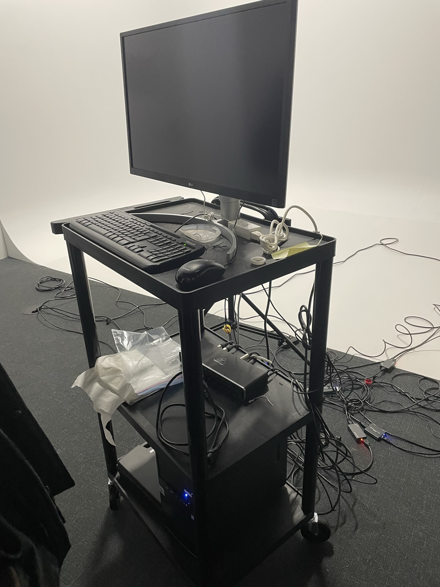

# Jeu temporel #

## Créateurs ##
### Raphaël Fillion et Philippe Trudel ###

## la façon dont le thème du temps est exploité dans la création ##
### Nous souhaitons sensibiliser la génération actuelle sur les conséquences écologiques de nos actions pour le futur. Nous voulons également que notre expérience puisse faire réagir l'utilisateur sur l'importance de l'environnement et susciter son action. Aussi Notre projet fait participer le ou les participants dans un jeu qui veut faire réaliser et voir les impacts de nos choix individuel et en tant que société dans cette crise climatique. (Texte pris de : [l'oeuvre du jeu temporel](https://tim-montmorency.com/2022/projets/Jeu-Temporel/docs/web/preproduction.html#Intention-ou-concept)) ###

## Ambiance ##
### Le visuel devant l'expérience serait de montrer en facade de la couleur, une musique agréable, un thème de fête. La personne qui va faire l'expérience va donc avoir des attentes différentes à ce qu'il va vivre durant le jeu. On veut vraiment faire ressentir à l'intéracteur le changment d'ambiance tout au long de l'expérience. Il va avoir un animateur qui, tout au long de l'expérience, changera d'apparence selon où l'intéracteur est rendu. Il va aussi avoir des 'glitchs' pour renforcer l'idée que l'expérience se transforme. (Texte pris de : [l'oeuvre du jeu temporel](https://tim-montmorency.com/2022/projets/Jeu-Temporel/docs/web/preproduction.html#Intention-ou-concept))

## Photo ##

![Photo](

![Photo](

